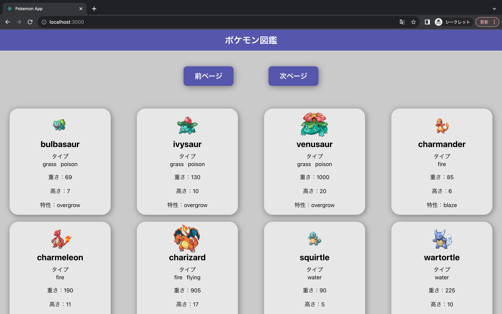
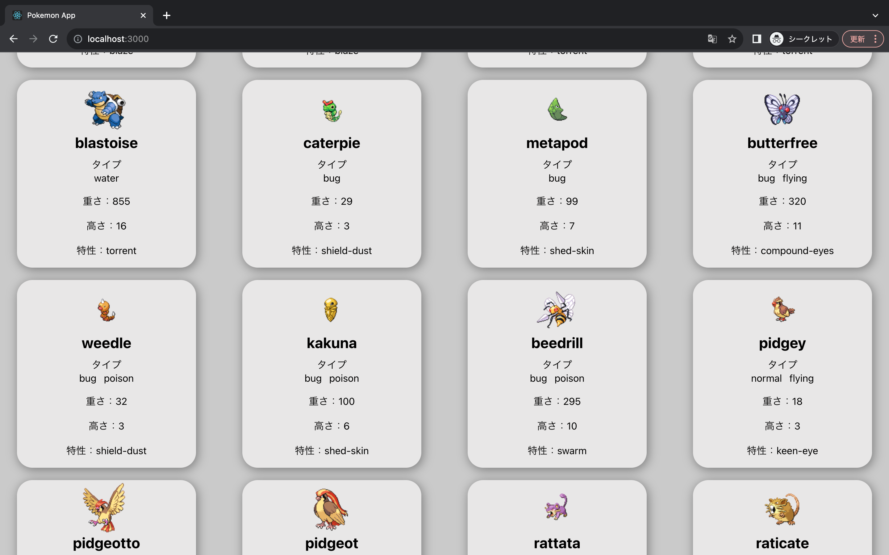
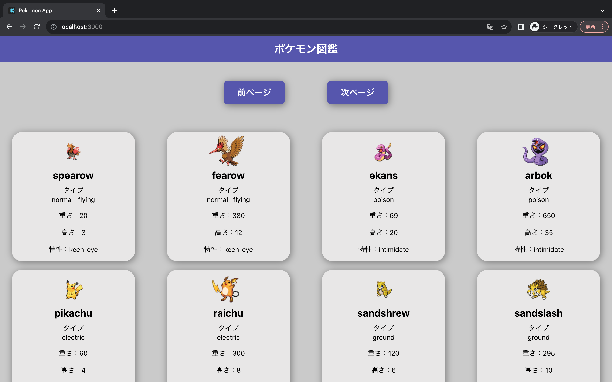

# 内容

1 ページにつき、ポケモン 20 匹分が表示されます。 
ポケモン API を用いて画像や名前を表示しています。 
次ページボタンや前ページボタンを押すことで前後のポケモンを 20 匹表示します。

1\. 以下のページは 1 ページ目の前半部分です。

 

2\. 以下のページは 1 ページ目の後半部分です。

 

3\. こちらが 2 ページ目となっており、 1 ページと同様にポケモン 20 匹分が表示されます。

